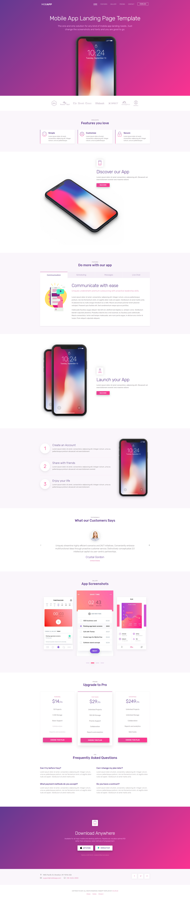

.. ==================================================
.. FOR YOUR INFORMATION
.. --------------------------------------------------
.. -*- coding: utf-8 -*- with BOM.

.. include:: ../Includes.txt

What does it do?
================

This extension is a sitepackage that integrates an existing HTML/CSS template.

**This version is just a showcase and just the base code to create a t3theme extension.** The scope of t3themes end there, where the **structured content** scope begins. We hope, that strict seperation of theme and content  will be positive to for the development of structured content. T3themes can work without EXT:t3cms, if you outsource/copy the T3themesConfProcessor. You will find further information about t3ms in its Documentation_.

.. _Documentation: https://docs.typo3.org/typo3cms/extensions/t3cms/

The integrated Theme is MobApp_ by HTML5UP.

.. _MobApp: https://colorlib.com/etc/MobApp/index.html

	Screenshot from the static html&css demo on he internet.

